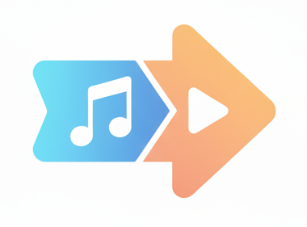
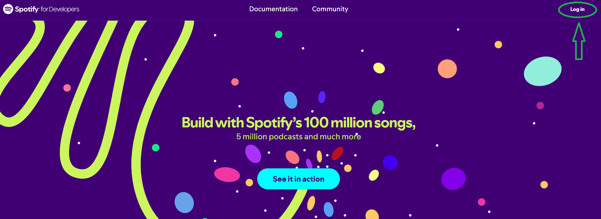
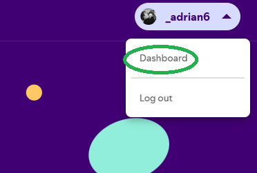
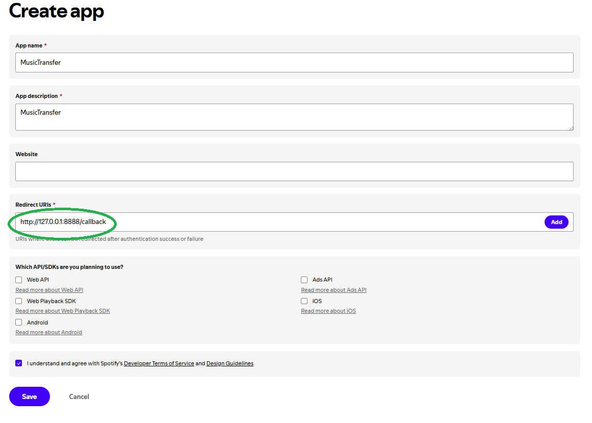
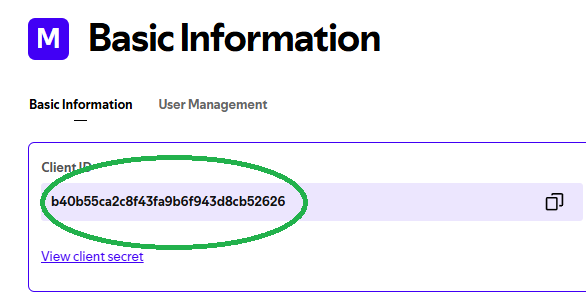
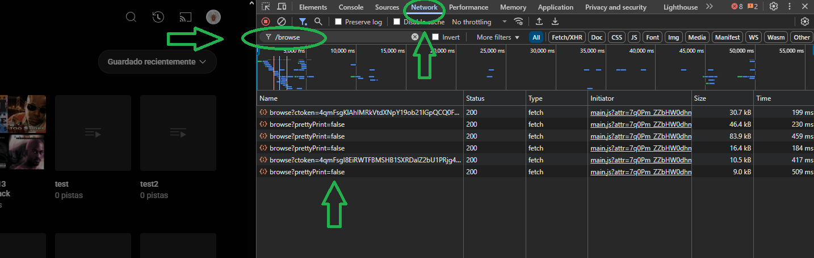
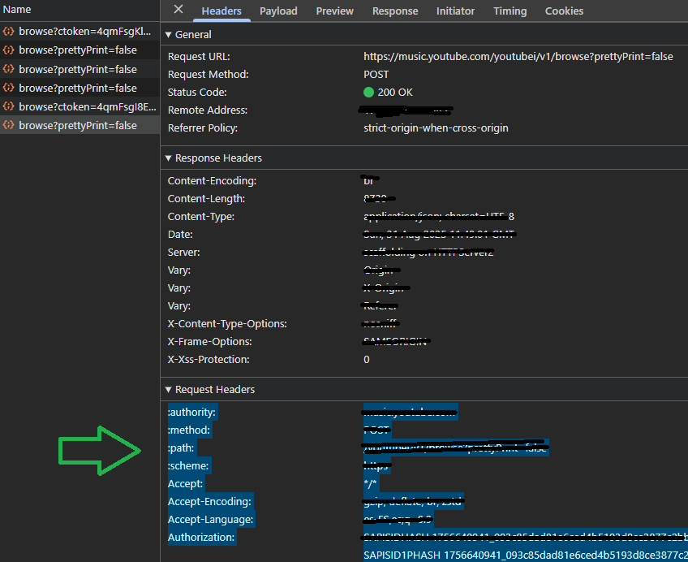

<p align="center">
  
</p>

# MusicTransfer

**MusicTransfer** is a small program that lets you transfer songs and playlists between **Spotify** and **YouTube Music** — completely free of charge.

---

## 📑 Table of Contents
- [Sign in with Spotify](#sign-in-with-spotify)
- [Sign in with YouTube Music](#sign-in-with-youtube-music)

---

## Sign in with Spotify

To use this program, you’ll need a **Spotify Developer account**, since Spotify only allows apps created under an organization (not individuals).

### Getting Started

1. Go to [https://developer.spotify.com](https://developer.spotify.com)  
2. Log in with your Spotify account  

<p align="center">
  
</p>
  
3. Once logged in, go to the **Dashboard**

<p align="center">
  
</p>

4. Click on **"Create an App"**  
5. Fill in the required information  
   - In the **Redirect URIs** section, add:  
     ```
     http://127.0.0.1:8888/callback
     ```

<p align="center">
  
</p>

6. After creating the app, copy your **Client ID** into the program  

<p align="center">
  
</p>
    
7. Click on **"Sign In"** inside the program. A browser window will automatically open (if two appear, just close one). Spotify will then ask for permission to access your music and playlists.  

   Don’t worry about privacy — the program runs **only on your computer**, doesn’t use any external servers, and nobody else can access your data. Everything stays private between you and Spotify.  

8. Once you grant permission, wait a few seconds… and you’re in! 🎶

---

## Sign in with YouTube Music

Just like Spotify, YouTube also places restrictions on accessing its APIs. Since YouTube Music’s official APIs are paid and not suitable for a free tool like this, the login process works a bit differently.

Follow these steps:

1. Go to [https://music.youtube.com](https://music.youtube.com).  
   👉 Tip: it’s recommended to use a private/incognito browser window.  
2. Sign in with your YouTube account.  
3. Open the developer tools with **Ctrl + Shift + I** (or right click → *Inspect*).  
4. Go to the **Network** tab and filter by:
    ```
     browse
     ```

<p align="center">

</p>

5. Click on any **POST** request that appears. If none show up, just navigate around YouTube Music (e.g., go to *My Library* or open a playlist) until one appears.  

<p align="center">

</p>

6. Copy **all** the information inside the **Request Headers** section and paste it into the program.  

---

✅ Done! Now MusicTransfer can connect to both platforms and help you move your playlists easily.  


